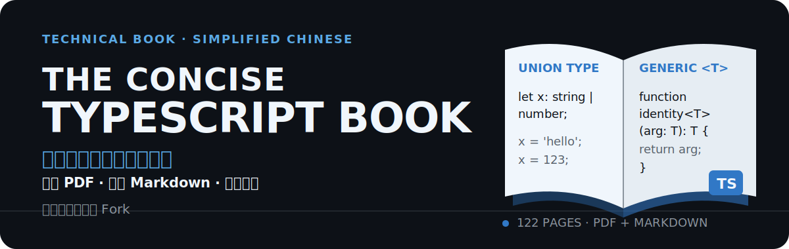
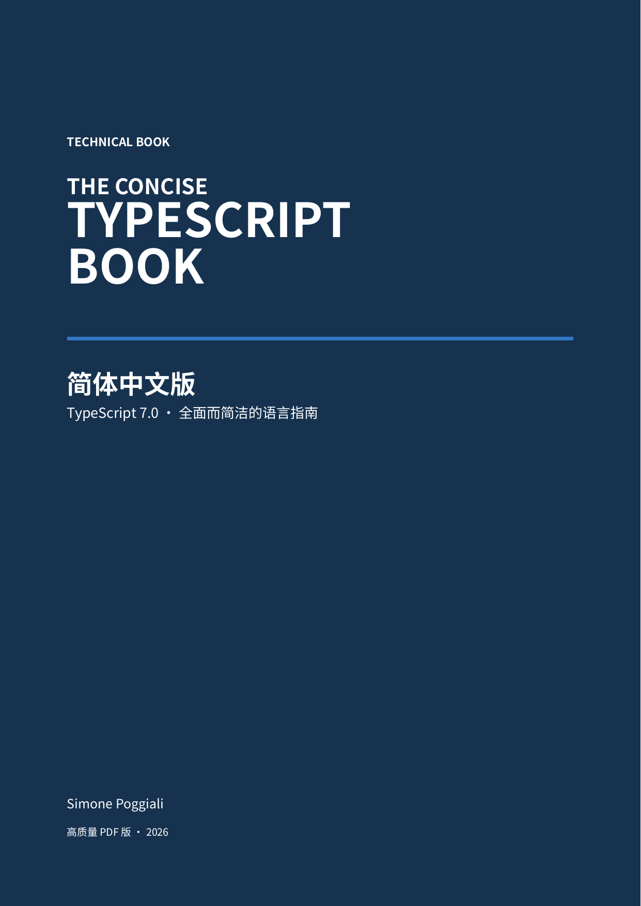

  

本仓库是 [gibbok/typescript-book](https://github.com/gibbok/typescript-book) 的非官方个人学习 Fork，提供经少量文字与排版修订的简体中文 PDF，以及可搜索、可引用的中英文 Markdown 书稿。

  <strong><a href="downloads/The_Concise_TypeScript_Book_zh-CN.pdf">下载《The Concise TypeScript Book》简体中文 PDF（122 页）</a></strong>

  

  封面为 122 页简体中文 PDF 的第 1 页；点击即可下载。

## 阅读入口

* [下载简体中文 PDF](downloads/The_Concise_TypeScript_Book_zh-CN.pdf) — 适合离线、连续阅读。
* [简体中文 Markdown 书稿](book/The_Concise_TypeScript_Book_zh-CN.md) — 适合搜索和引用。
* [英文 Markdown 书稿](book/The_Concise_TypeScript_Book_en.md) — 适合中英文对照。
* [其他下载文件](downloads/) — 查看仓库中的其他格式和语言版本。

## 关于本 Fork

本 Fork 主要用于个人学习和资料整理，修复了简体中文版本中的少量文字和排版问题。

* 简体中文 PDF 根据修订后的内容重新生成，并非上游作者发布的官方中文版本；内容仍可能存在遗漏或错误。
* 修订过程使用了 ChatGPT Work 辅助校对和整理。
* ChatGPT Work 不是本书的作者、译者或版权所有者。
* 相关修改未经原作者审核、认可或背书。
* 如对内容有疑问，或需要获取权威内容和最新更新，应以上游仓库为准。

## 上游项目

上游项目：[gibbok/typescript-book](https://github.com/gibbok/typescript-book)

原作者：Simone Poggiali

原始作品和主要内容由上游作者创建。本 Fork 不主张对原始书籍内容拥有原创版权；获取最新内容时，请以上游仓库为准。

## 许可证与版权

[查看许可证](LICENSE.MD)

本仓库继续遵循上游项目许可证，原作者署名和版权声明保持不变。“主要用于个人学习”只是用途说明，不是新增的法律限制。
